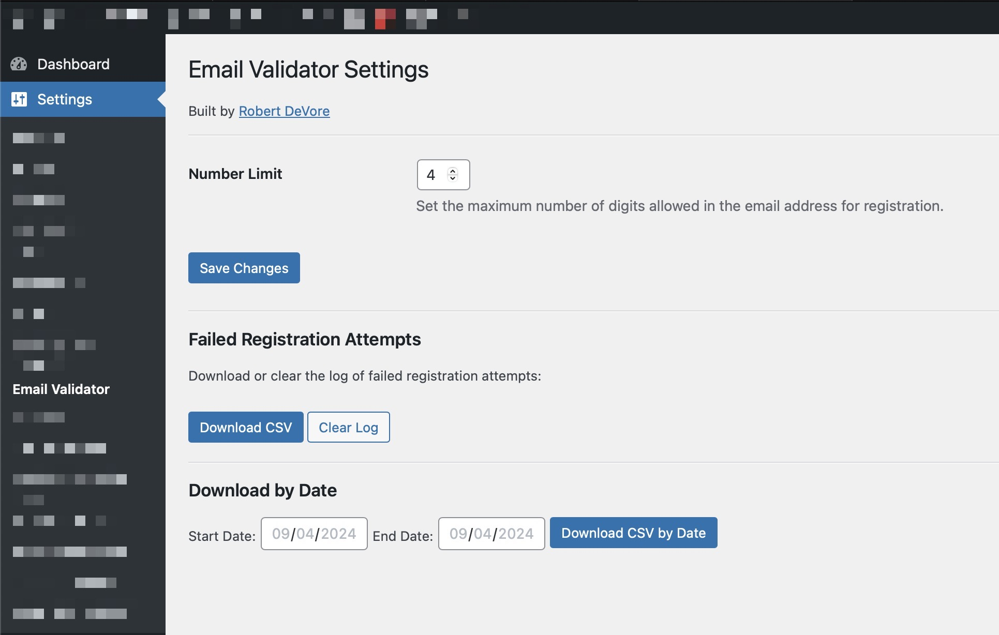

# Email Validator for WordPress

A plugin that prevents user registration if the email address contains more numbers than a specified limit. The plugin works for both WordPress and WooCommerce registration forms and logs failed attempts.

## Description

**Email Validator for WordPress** helps prevent spammy registrations by validating the number of digits in the email address during user registration. If the email contains more numbers than the configured limit, the registration is blocked.

**Features:**

- Validates emails during WordPress and WooCommerce registration.
- Allows admins to set the maximum number of digits allowed in email addresses.
- Logs failed registration attempts.
- Allows admins to download the log as a CSV file or clear the log.
- Supports downloading logs within a specified date range.
- Fully localized and translation-ready.

### Installation

1. Upload the plugin files to the `/wp-content/plugins/email-validator-wp` directory, or install the plugin through the WordPress plugins screen directly.
2. Activate the plugin through the 'Plugins' screen in WordPress.
3. Navigate to **Settings > Email Validator** to configure the plugin.

### Usage

1. Set the maximum number of digits allowed in an email address via **Settings > Email Validator**.
2. If a registration attempt contains an email with too many digits, it will be blocked, and the attempt will be logged.
3. Admins can download the log of failed registration attempts or clear the log from the settings page.
4. Optionally, filter the log by date and download the results as a CSV file.

### Frequently Asked Questions

#### How do I configure the plugin?

After activation, navigate to **Settings > Email Validator** to configure the maximum number of digits allowed in email addresses. You can also download and clear the log of failed registration attempts.

#### Does this work with WooCommerce?

Yes! If WooCommerce is active, the plugin will automatically validate WooCommerce registrations as well.

#### Can I download failed attempts as a CSV?

Yes, the plugin provides the option to download all failed registration attempts as a CSV file, with an optional date filter.

### Screenshots

1. **Settings Page:** The Email Validator settings page, where you can configure the digit limit and manage logs.
   

### Changelog

#### 1.0.0
- Initial release.

### License

This plugin is licensed under the GPLv2 or later. You are free to modify and redistribute this plugin under the same license.

### Credits

Developed by [Robert DeVore](https://robertdevore.com).